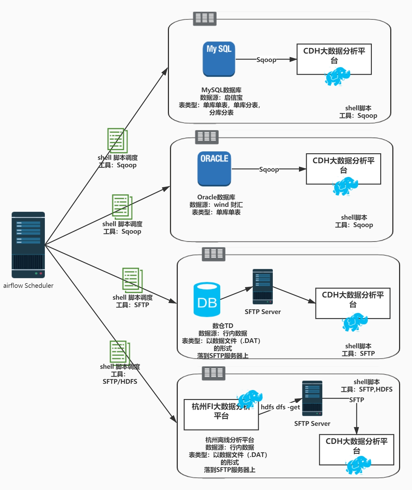
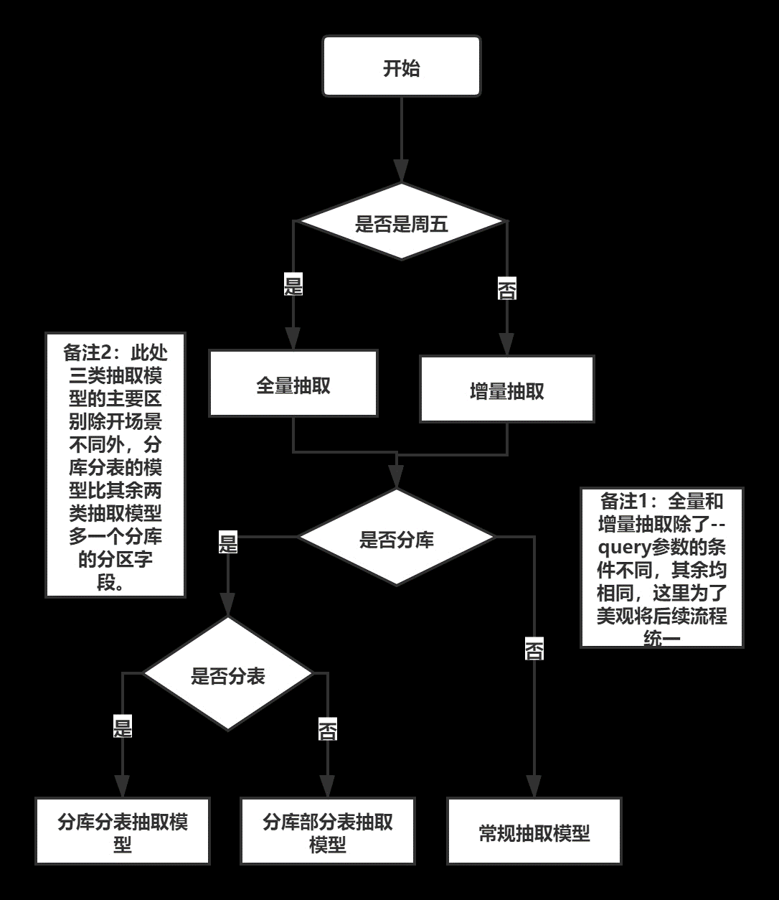
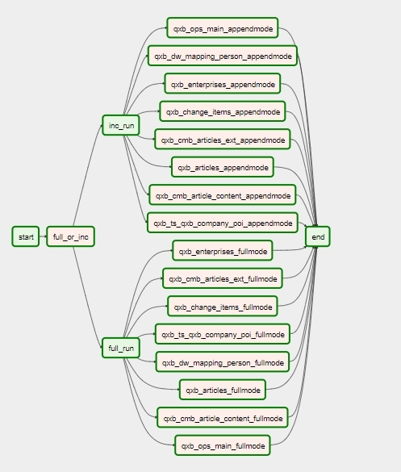
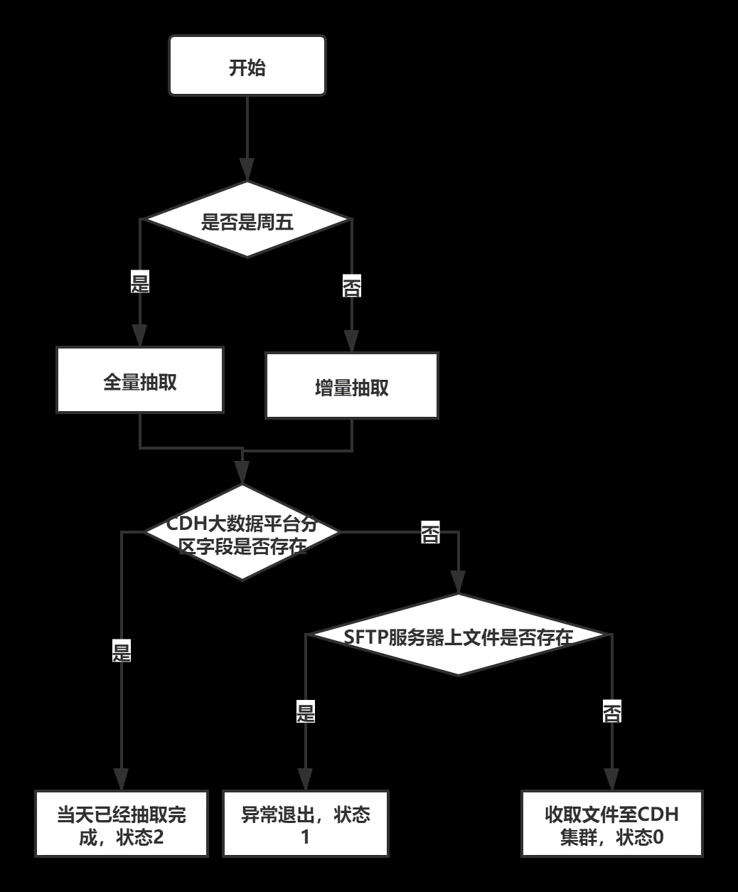
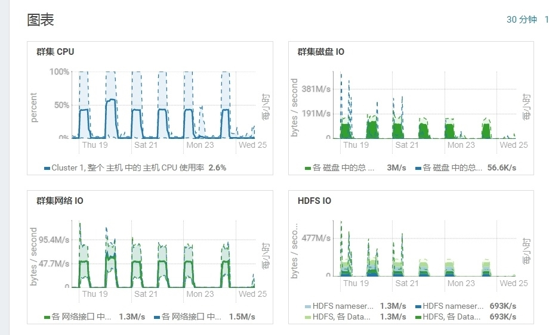
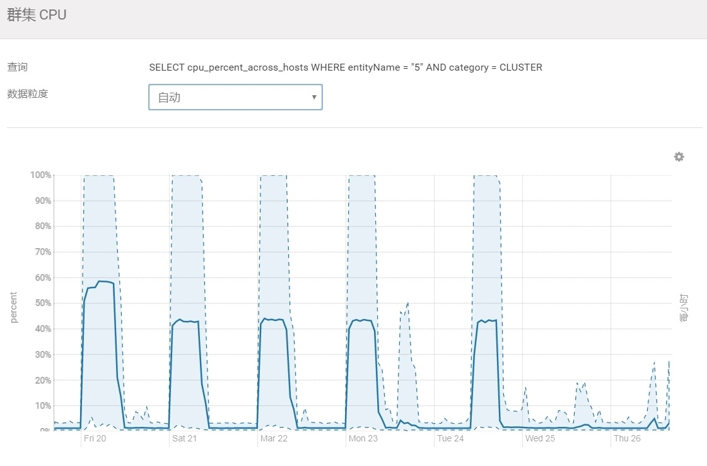
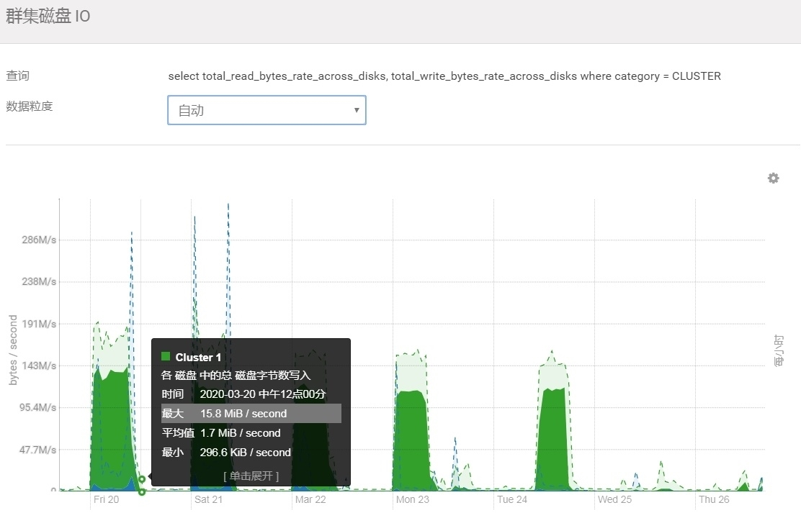
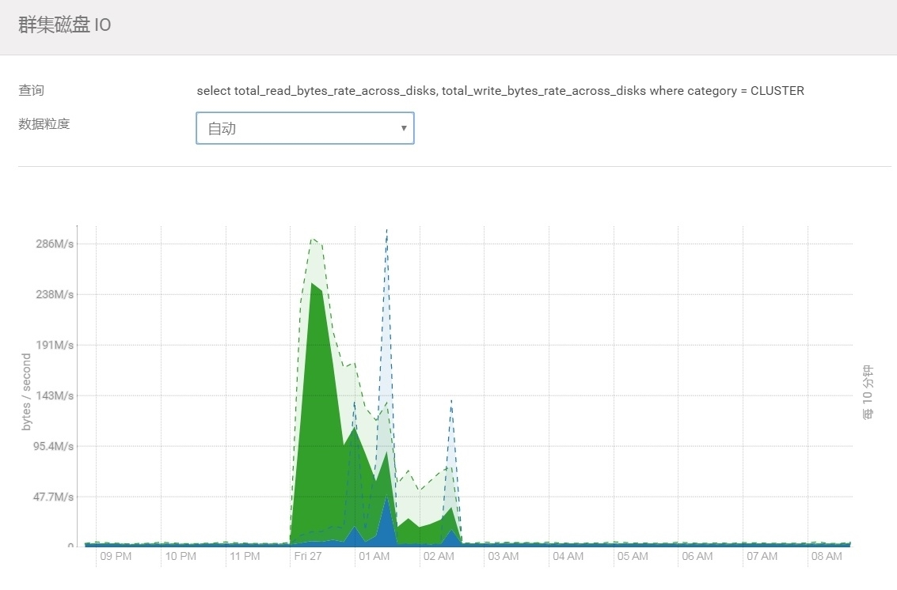
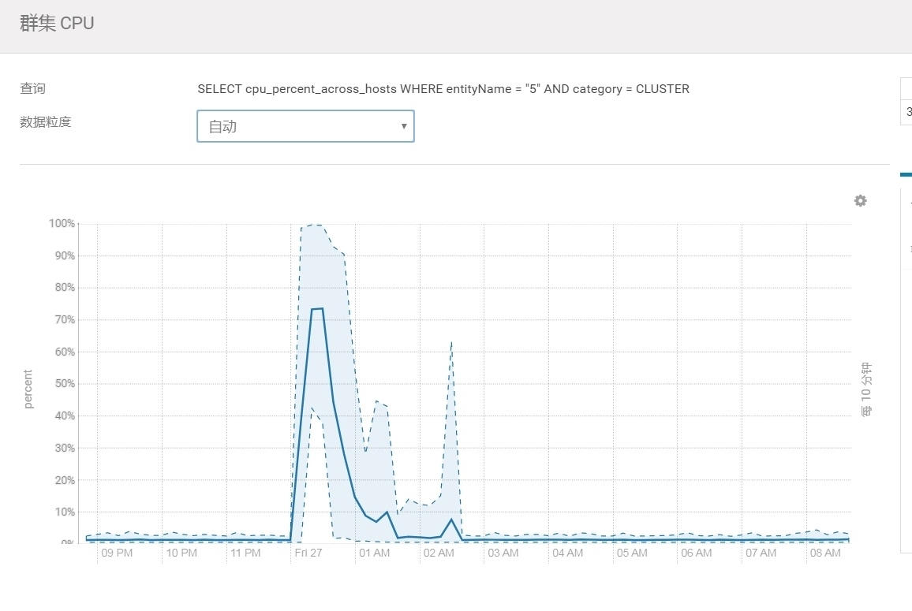

# ETLworks
当前Airflow调度任务主要分为四类，共三个文件（shell脚本），
其中对于Mysql和Oracle的数据抽取任务放在一起，包含下述图片的所有表类型的抽取。
对于TD和离线分析平台的数据文件抽取单独成脚本，调度流程如下图所示：



###Mysql/Oracle文件抽取

由于代码具有通用性以及相似性，Mysql/Oracle的抽取结合在了一起，对接数据源为启信宝、万得、财汇。更新周期为：周五全量更新，其余时间为增量更新。运行起始时间为每天凌晨0点，由Airflow负责调度，每个任务Task中并行的抽取数目数为16。Task的上线数目为50。数据文件在CDH集群的命名路径为：

- **${hive外部表数据存储路径}/${表名}/${分区字段1:分库名} /${分区字段2:时间}** 
           
1. 其中对于非分库分表的情形不存在分区字段1，每次shell脚本会将sqoop任务提交到不同CDH的NameNode（目前dev环境为两台）。
2. 随后启动sqoop提交任务到YARN，由YARN负责调度的一系列细节问题，从Mysql/Oracle以数据文件的形式将文件放在CDH集群对应的数据文件下。
3. 随后修复分区表，刷新分区数据，让Hive外部表能够感知到分区数据的变化。






###TD数仓文件抽取

对于TD数仓文件的抽取采取SFTP的方式，由Airlow调度CDH的NameNode通过SFTP将数据文件传输到本地的文件目录下，
随后再通过HDFS命令将数据文件提交到集群并修复分区，最后再删除本地的数据文件。
Airflow在此处起到牵线搭桥的功能，由于当前行内数仓的SFTP解决方案存在两种版本，
2.0与3.0的区别对于应用开发者而言主要在于文件权限的控制粒度（2.0精确到目录，3.0精确到文件），
且杭州关于数仓抽数的相关表均会在2020年3月底完成平台到3.0的迁移，所以目前调度的shell脚本均按照3.0申请资源并设计，
更新的时间与调度的方式和Mysql/Oracle的文件抽取保持一致，文件路径的命名较为个性化，见腾飞采集到的Excel表格。



###杭州离线分析平台数据抽取

杭州离线分析平台的数据抽取主要是讲华为Fushion Insight大数据集群的数据文件导入到CDH大数据分析平台。由于Airflow和大数据平台的通信主要通过Beeline、Hdfs命令，而华为客户端的安装已经将Beeline命令高度封装，不方便以通过修改变量的方式同时连接华为FI集群以及dev的CDH集群，故采用Airflow机器将华为FI机器的数据文件通过Hdfs命令下载到本地，随后调度CDH的一台NameNode运用SFTP传输到节点客户端，再通过CDH客户端上的Hdfs命令将数据文件传输到对应的集群，随后删除流程过程中放在不必要位置的中转数据文件，更新的时间与调度的方式和Mysql/Oracle的文件抽取保持一致，文件路径的命名较为个性化，见腾飞采集到的Excel表格。
###Airflow调度详情

当前CDH集群的CPU利用率为60%，集群当前跑完 6个调度，共110个（左右）任务。所用的整体时间为：8H（未优化前）。


代码更新后，主要优化点为：
- 分库分表或不分库分表写法改成一次抽一个库，对应分库表16个库分区
- 全量抽取也需要增加时间限制，时间小于当天00：00：00
- 数量统计增加时间限制，时间小于当天00：00：00
- 增加任务提交的hiveserver的参数化配置
- 时间分区写成前一天，T-1

优化后的资源消耗如下所示，集群当前跑完 6个调度，共110个（左右）任务。所用的整体时间为：2H+（优化后)，CPU利用率达到70%左右，均有不错的提高。



##文件存储目录及表命名规则

#### 外部表hdfs存储路径命名规则:

/data/externalData(外部数据)/数据源/表名/分区名1/分区名2

|数据源|外部表路径|
|:----:|:----:|
|Qxb|/data/externalData/qxb/|
|Wind|/data/externalData/wind/|
|财汇|/data/externalData/caihui/|
|TD|/data/externalData/td/|
|离线分析平台FI|/data/externalData/lxfi/|

具体路径下以：数据源+源表名作为子路径命名方式    /data/externalData/qxb/qxb_t_patents
- 若源表分库则第一分区键为part=，
- 第二分区键为时间分区part_dt=                   
- 多分区：/data/externalData/qxb/qxb_t_enterprises/part=0/part_dt=20200226
- 若源表为单表则只有第一时间分区键part_dt=                                                      单时间分区：/data/externalData/qxb/qxb_t_patents/part_dt=20200226

#### Hive表命名方法

- 数据分层命名
- 贴源层：stg
- 基础层：fdm-x
- 汇总层：gdm-x

贴源层表名命名：stg.数据源_源表名。 贴源层统一采用外部表，基础层和汇总层计划采用内部表，通过分层名称与贴源层（stg）进行区分。
外部表建表时需指定数据文件目录及分区格式，以便和sqoop文件抽取相勾联。
stg外部表建表示例：
```sql
create external table if not exists stg.qxb_t_address (
  `id` bigint,
  `eid` char(36),
  .......
  `ins_time` timestamp
 ) partitioned by (
   part string,   
   part_dt string
)
ROW FORMAT DELIMITED
FIELDS TERMINATED BY '\001'
LINES TERMINATED BY '\n'
LOCATION '/data/externalData/qxb/qxb_t_address';
```


